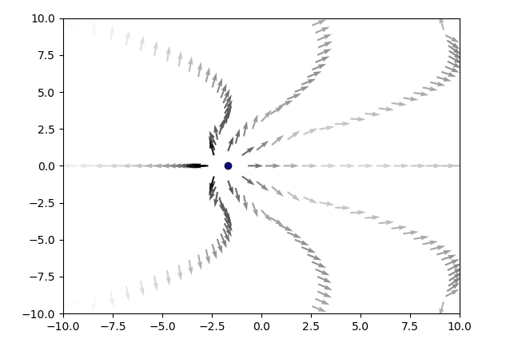

# electrodynamics
Plots the electric field of a moving point charge. More precisely, it is the Liénard–Wiechert electric field as given in https://en.wikipedia.org/wiki/Li%C3%A9nard%E2%80%93Wiechert_potential#Field_computation

