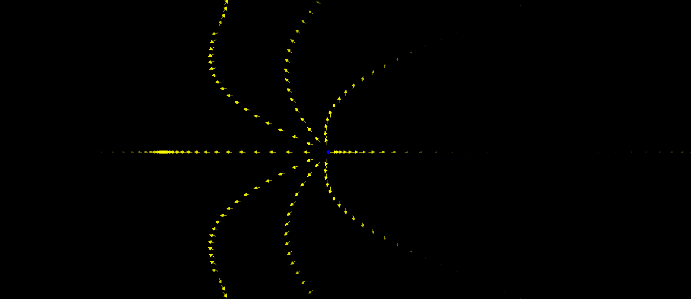

# electrodynamics

There are several use cases:

## 1.Plot electric field of a charged particle

Plots the electric field of a moving point charge. More precisely, it is the Liénard–Wiechert electric field as given in https://en.wikipedia.org/wiki/Li%C3%A9nard%E2%80%93Wiechert_potential#Field_computation

 ##### How to run:

 1. Run simulation.py
 2. Open client.html in the browser.

## 2.Simulate an antenna (using jefimenko's equations)

Plots the electric field generated by an antenna. We model the antenna as a rod with a stream of charges going up and down sinusoidally (i.e., the current is sinusoidal). The dots (in the middle of graphic) are the tips of the rod where red means negative charge, blue means positive charge and the size of the dot is the magnitude of the charge.

##### How to run:

1. run jefimenko.py

##### React F/E (in construction):
1. Install `expo-cli` globally using `yarn`
2. Install dependency: navigate to `react-client` folder, then run `>>> yarn`
3. Start server to listen to F/E requests
4. Run F/E: (in the same `react-client` folder): run `>>> yarn web`
